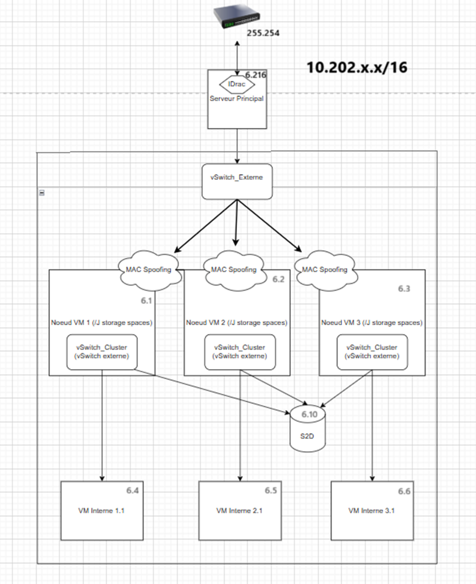
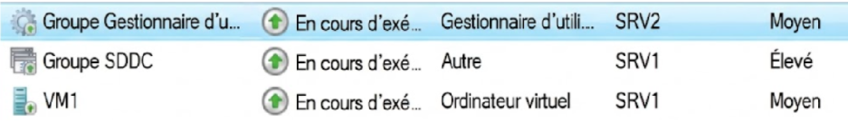

CASTELLI - MASNY
## Projet de Migration : Sortir de VMware


### SYNTHÈSE : Scénario de Sortie de VMware

Nous avons choisi de  sélectionner Proxmox et HyperV
#### Verdict : Choix de Proxmox VE

Notre analyse technique et financière désigne **Proxmox VE** comme la meilleure solution de remplacement.

### 4 Arguments Décisifs

1.  Rentabilité Immédiate
Proxmox permet une économie de 40 000 € à l'achat pour 3 serveurs par rapport à Hyper-V (Licences Datacenter + Veeam). Il reste plus rentable jusqu'à 58 VMs.

2.  Migration Fluide (VMware)
Proxmox, depuis quelques versions, intègre un assistant d'import qui aspire les VMs VMware en quelques clics. À l'inverse, Hyper-V impose une conversion de format peu arrangeant.

3.  Rapidité de Mise en Œuvre
L'installation de Proxmox est "clé en main" (Cluster + Ceph + Réseau opérationnels en 4h). Hyper-V (S2D dans notre cas) est quand même plus compliqué, nécessitant une configuration assez complexe.

4.  Solution "Tout-en-un"
Proxmox inclut nativement le Stockage Distribué (Ceph) et le Backup (PBS). Hyper-V nécessite des rôles en plus ou des logiciels tiers payants.

### Visualisation Stratégique


Conclusion :
Bien que Microsoft Hyper-V soit une solution assez viable pour les entreprises déjà "Full Microsoft", Proxmox VE surpasse son concurrent sur les critères de coût, de simplicité et d'outillage de migration, répondant parfaitement à la problématique de remplacement de VMware.

---

# PARTIE 1 : DOSSIER D'ARCHITECTURE TECHNIQUE (PROXMOX VE)
**Responsable :** Alexandre

## 1. Présentation de l'Architecture

Cette partie décrit la techniques de l'infrastructure de virtualisation mise en place. L'architecture repose sur le principe de **Virtualisation Imbriquée (Nested)** pour simuler un cluster de production à trois nœuds sur un serveur physique unique.

### 1.1 Matériel Physique (Niveau 0)

L'hôte physique est un serveur Dell PowerEdge R640 :

* **CPU :** AMD EPYC (Instructions SVM activées).
* **RAM :** Dimensionnée pour supporter 3 hyperviseurs virtuels.
* **Stockage :** 2x SSD 1.7 To configurés en **RAID 1 Matériel** (Contrôleur PERC H730P).
* **Réseau :** Interface `eno1` (1 Gbps) connectée au switch de salle.

### 1.2 Architecture Logique (Niveau 1)

Le cluster Proxmox (`SAE-Cluster`) est composé de trois nœuds virtuels interconnectés via le protocole Corosync.

| Nœud | Hostname | IP Management | Rôle |
| :--- | :--- | :--- | :--- |
| **Node 1** | `pve1` | `10.202.6.220` | Calcul + Stockage (Ceph/ZFS) |
| **Node 2** | `pve2` | `10.202.6.221` | Calcul + Stockage (Ceph/ZFS) |
| **Node 3** | `pve3` | `10.202.6.222` | Calcul + Stockage (Ceph/ZFS) |

---

## 2. Configuration de l'Hyperviseur

### 2.1 Virtualisation Imbriquée
Pour permettre l'exécution de machines virtuelles (KVM) à l'intérieur des nœuds virtuels, le mode CPU "Host" a été forcé dans la configuration de l'hyperviseur racine.
### 2.2 Configuration Réseau

Le réseau repose sur un pont Linux standard (`vmbr0`) sans VLAN tagué au niveau de l'hôte, la segmentation étant gérée en amont.

**Configuration réseau type (`/etc/network/interfaces`) :**

```
auto lo
iface lo inet loopback

auto eno1
iface eno1 inet manual

auto vmbr0
iface vmbr0 inet static
    address 10.202.6.220/16 < ici par exemple c'est le node 1
    gateway 10.202.6.254
    bridge-ports eno1
    bridge-stp off
    bridge-fd 0
```
#### 2.3 Optimisation des Flux Cluster (Corosync)

Le bon fonctionnement d'un cluster Proxmox repose sur **Corosync**, le moteur de communication inter-nœuds.

- **Contrainte critique :** Corosync exige une latence réseau inférieure à 2ms.
- **Problématique Nested :** Dans notre environnement virtualisé, le réseau est partagé.
- **Configuration Kronosnet (knet) :** Proxmox 8 utilise par défaut le transport _Kronosnet_ en Unicast. Cela nous évite la complexité de configuration du Multicast (IGMP Snooping) sur les switchs physiques Dell, tout en garantissant le chiffrement des échanges de contrôle entre les nœuds `pve1`, `pve2` et `pve3`.
---

## 3. Stratégie de Stockage Hybride

L'infrastructure utilise une approche hybride combinant stockage distribué, local et répliqué.

### 3.1 Stockage Distribué : Ceph RBD

Utilisé pour la Haute Disponibilité (VMs Web & DNS).

- **Version :** Ceph Reef (18.2).
- **Topologie :** 3 Moniteurs (MON), 3 Managers (MGR), 3 OSDs.
- **Pool :** `pool-vms` (Size: 3, Min_size: 2).
- **Volume :** Chaque nœud contribue avec un vDisk de 100 Go (`/dev/sdb`).

**État du Cluster :**


#### 3.1.1 Fonctionnement de l'algorithme CRUSH

Contrairement à un RAID classique qui utilise une table d'allocation centralisée (goulot d'étranglement), Ceph utilise l'algorithme **CRUSH** (Controlled Replication Under Scalable Hashing).

- **Distribution :** Lorsqu'une VM écrit une donnée, le client calcule à la volée sur quel OSD (Disque) la donnée doit aller.
- **Réplication Synchrone :** Avec un `size=3` et `min_size=2`, l'écriture n'est confirmée à la VM que lorsque la donnée a été écrite physiquement sur **au moins 2 nœuds**. Cela garantit qu'aucune perte de données n'est possible même en cas de coupure électrique immédiate après une écriture.
- **Backend BlueStore :** Les OSD ont été formatés avec le backend _BlueStore_, qui permet à Ceph d'écrire directement sur le disque brut (raw device) sans passer par une couche de système de fichiers (ext4/xfs), augmentant ainsi les IOPS.
### 3.2 Stockage Local : ZFS

Utilisé pour les performances I/O (VM Client).

- **Pool :** `zfs-local`
- **Configuration :** Single Disk (`/dev/sdc`) avec compression LZ4 activée.
#### 3.2.1 Gestion de la mémoire et Compression (ARC)

L'utilisation de ZFS implique une consommation mémoire spécifique liée à l'**ARC (Adaptive Replacement Cache)**.

- **Stratégie :** ZFS utilise la RAM disponible pour mettre en cache les données les plus fréquemment lues (Read Cache). C'est pourquoi nos nœuds virtuels ont été dimensionnés avec 32 Go de RAM, afin de laisser environ 4 Go à l'ARC pour accélérer les VMs.
- **Compression LZ4 :** J'ai activé la compression LZ4 sur le pool. C'est un algorithme "zero-cost" : la vitesse de compression du CPU est plus rapide que la vitesse d'écriture du disque. Cela nous permet de gagner environ **1.4x** d'espace disque tout en augmentant virtuellement la vitesse d'écriture.
### 3.3 Stockage de Sauvegarde : ZFS Replication

Utilisé pour le PRA du serveur de backup.

- **Source :** `pve3/zfs-repl`
- **Cible :** `pve2/zfs-repl`
- **Fréquence :** Synchronisation toutes les 15 minutes.

---

## 4. Services Déployés

### 4.1 Serveur DNS (VM 105)

- **OS :** Alpine Linux.
- **Logiciel :** ISC Bind9.
- **Zone :** `sae.lan`
### 4.2 Serveur Web (VM 106)

- **OS :** Alpine Linux
- **Logiciel :** Nginx  
- **Contenu :** Page statique HTML accessible via `www.sae.lan`    
### 4.3 Proxmox Backup Server (VM 110)

- **IP :** `10.202.6.255`.
- **Rôle :** Centralisation des sauvegardes dédupliquées.
- **Datastore :** `backup-store` (sur ZFS).    

### 4.4 Proxmox Datacenter Manager

- **IP :** `10.202.6.255`
    
- **Rôle :** Supervision centralisée et interface de gestion globale du cluster.
    
- **Fonction :** Monitoring en temps réel de la charge et des nœuds.
---

## 5. Mécanismes de Résilience

### 5.1 Haute Disponibilité (HA)

Le gestionnaire de ressources  de Proxmox est configuré pour surveiller les VMs critiques.

- **Groupe HA :** `critical-services`
- Tentative de migration, sinon redémarrage.
- **Membres :** VM 105 (DNS), VM 106 (Web).
#### 5.1.1 Gestion du Quorum et Watchdog

La stabilité du cluster repose sur le concept de **Quorum** (Majorité de votes).

- **Vote :** Nous avons 3 nœuds, donc 3 votes. La majorité requise est de 2.
- **Scénario de Panne :** Si le Nœud 1 tombe, les Nœuds 2 et 3 conservent le Quorum (2 votes > 1.5). Ils décident alors de "tuer" (Fence) le Nœud 1 pour éviter qu'il ne corrompe les données, puis redémarrent ses services.
- **Protection Watchdog :** Un mécanisme de "Watchdog" matériel (émulé ici par le noyau Linux `softdog`) est actif sur chaque nœud. Si le nœud perd le contact avec le cluster pendant plus de 60 secondes, le Watchdog force un redémarrage brutal du serveur (Hard Reset) pour garantir l'intégrité du système (Self-Fencing).

### 5.2 Plan de Reprise d'Activité

En cas de perte totale du nœud hébergeant le PBS, la réplication ZFS permet le redémarrage du service de sauvegarde sur le nœud voisin sans restauration longue, garantissant l'accès aux archives de backup.

---

# PARTIE 2 : DOSSIER TECHNIQUE - HYPER-V (Romain)

**Responsable :** Romain

## 1. Introduction et Architecture Globale

Cette partie détaille la méthodologie de mise en œuvre d'une infrastructure de virtualisation à haute disponibilité (HA).

Pour simuler un environnement avec plusieurs nœuds avec notre matériel, nous avons déployé une architecture en **Virtualisation Imbriquée (Nested Virtualization)** :

- **Niveau 0 (Physique) :** Serveur Dell exécutant Windows Server Datacenter.
- **Niveau 1 (Logique) :** Cluster de 3 machines virtuelles agissant comme nœuds.
- **Stockage :** Agrégation logicielle des disques via la technologie **Storage Spaces Direct (S2D)**.

---

## 2. Préparation de l'Infrastructure Physique (Niveau 0)

### 2.1 Matériel

L'infrastructure repose sur un serveur Dell (Switch 6). La première étape a consisté à faciliter l'administration via la carte de gestion à distance (iDRAC).

- **Adressage iDRAC :** `10.202.6.216 /16`
- **Passerelle :** `10.202.255.254`

L'accès iDRAC nous a permis de piloter l'alimentation, de monter les images ISO virtuellement et d'accéder à la console distante pour l'installation de l'OS.

### 2.2 Stockage Physique

Pour garantir le bon fonctionnement du futur S2D, il était important de présenter des disques vierges. Nous avons procédé à un nettoyage avant l'installation de l'OS, convertissant les disques au format GPT.

---

## 3. Configuration de l'Hyperviseur Hôte

### 3.1 Système d'Exploitation et Licences

Le choix s'est porté sur Windows Server édition Datacenter.

Contrairement à l'édition Standard, la version Datacenter est un prérequis pour l'activation de la fonctionnalité S2D et permet une virtualisation illimitée.

### 3.2 Activation du "MAC Address Spoofing"

C'est un point de configuration assez important pour le Nested Clustering. Par défaut, un port de vSwitch Hyper-V n'accepte que les trames provenant de l'adresse MAC de la VM connectée.

Or ici, les VMs imbriquées génèrent des trames avec leurs propres adresses MAC.

Nous avons activé l'usurpation d'adresse MAC sur les cartes réseaux virtuelles des 3 nœuds pour autoriser le transit de ces paquets :

PowerShell

```
Get-VMNetworkAdapter -VMName "Node*" | Set-VMNetworkAdapter -MacAddressSpoofing On
```

Sans cette commande, aucune communication réseau vers les VMs finales n'aurait été possible.

---

## 4. Implémentation du Cluster S2D (Cœur du système)

### 4.1 Storage Spaces Direct (S2D)

S2D permet de créer un stockage hautement disponible en utilisant des disques locaux attachés à chaque serveur, éliminant le besoin d'une baie SAN physique.

#### 4.1.1 Activation

Nous avons activé S2D (`Enable-ClusterS2D`) pour qu'il prenne le contrôle des disques, permettant à chaque nœud de lire et écrire sur les disques des voisins via le réseau.

#### 4.1.2 Stratégie de Résilience : Miroir à 3 Voies

Nous avons configuré le pool de stockage en **Miroir à 3 voies**.

- **Fonctionnement :** Chaque bloc de donnée est écrit simultanément sur 3 disques situés sur 3 nœuds différents.
- Cette méthode offre la résilience maximale. Elle permet de tolérer la panne simultanée de **2 nœuds** (ou 2 disques) tout en garantissant l'intégrité des données.

#### 4.1.3 Système de Fichiers ReFS

Les volumes partagés de cluster ont été formatés en ReFS (Resilient File System).

Avantages :

1. Détection et correction automatique de la corruption de données.
2. Optimisé pour la virtualisation et est donc plus performant.

#### 4.1.4 Gestion des vDisk

Lors de la création du volume vDisk_S2D (30 Go pour accueillir la VM), nous avons laissé 50 Go d'espace non alloué dans ce même pool.

Cet espace de réserve permet au système de lancer une reconstruction automatique en cas de perte d'un disque.

---

## 5. Déploiement des Services et Validation

### 5.1 Tests de Résilience et Résultats

Une série de tests a validé le bon fonctionnement de la solution :

|**Test Effectué**|**Méthodologie Technique**|**Résultat**|
|---|---|---|
|**Live Migration**|Déplacement d'une VM active entre Nœud 1 et Nœud 2 via `Move-ClusterVirtualMachineRole`.|**Succès :** 0 perte de ping. Continuité de service assurée.|
|**Failover (HA)**|Simulation d'une panne matérielle du Nœud hébergeant le service Web.|**Succès :** Le cluster a détecté la perte de signal et a redémarré la VM sur un autre nœud.|
|**Intégrité Stockage**|Simulation de déconnexion d'un disque physique du pool S2D.|**Succès :** Le volume est resté "Online" en mode dégradé. Les VMs n'ont subi aucune interruption.|

---

# PARTIE 3 : COMPTE RENDU D'ACTIVITÉ JOURNALIER (Commun)

Cette partie rend compte de l'avancement chronologique des travaux.

---

## Jour 1 : Préparation et Premiers Déploiements

### 1. Réorganisation de la Baie (Commun)

Avant toute chose, nous avons, avec l’aide d’autres groupes (notamment celui de Valentin, de Pierre et de Soyfoudine), réorganisé les baies de la salle pour avoir un **câblage propre** et identifier clairement les branchements de chaque groupe.


_Incident :_ Durant cette phase, une erreur de câblage a provoqué une boucle réseau, générant une tempête de broadcast d'environ **650 Go** sur le VLAN. L'incident a été identifié et corrigé grâce à l'intervention de Maxine.

Une fois le câblage fini, chaque groupe a pu connecter les cartes iDRAC de ses serveurs pour travailler à distance.

### 2. Configuration d’iDRAC et Adressage (Commun)

Nous avons configuré les cartes iDRAC de nos 2 serveurs (Switch 6 et 7).

Après analyse du plan d'adressage global (10.202.0.0/16), nous avons attribué une plage d'adresse à chaque groupe, et nous avons utilisé la plage 10.202.6.0/16.

|**Paramètre**|**Serveur Hyper-V (Romain)**|**Serveur Proxmox (Alexandre)**|
|---|---|---|
|**IP iDRAC**|`10.202.6.216`|`10.202.6.17`|
|**Masque**|`255.255.0.0`|`255.255.0.0`|
|**Passerelle**|`10.202.255.254`|`10.202.255.254`|

#### Test de connexion

Nous nous sommes connectés via l'interface WEB iDRAC.


### 3. Installation de l'Hyperviseur Proxmox (Alexandre)

Ici, je me suis occupé du 7eme serveur en partant du haut.

J'ai établi un premier cahier des charges : un hyperviseur principal (Bare Metal) hébergeant une infrastructure virtualisée (Nested) pour simuler un cluster, ce qui signifiait abandonner un des deux disques de 1TO7 qui m'étaient attribués. Je me suis rendu sur la console en ligne de l'idrac et j'ai chargé un média virtuel, j'ai chargé l'ISO de proxmox, j'ai ensuite redémarré le serveur et j'ai pu configurer mon proxmox.

1. **Installation :** Boot sur l'ISO Proxmox.
2. **Stockage :** Installation standard sur les disques disponibles (le RAID matériel n'était pas encore configuré à ce stade du projet).


Une fois terminé, on peut se rentre  sur l'IP qu'on a addressé sur la configuration du proxmox pendant son installation :


Une fois Proxmox opérationnel, j'ai déployé 3 VMs qui serviront de nœuds pour notre futur cluster Ceph.


**Optimisation et Choix Techniques Ceph :** La configuration à 3 nœuds permet de tolérer la perte d'un nœud sans interruption de service (N+1 redondance). L'algorithme CRUSH de Ceph assure une distribution pseudo-aléatoire mais déterministe des données, garantissant un équilibrage de charge automatique. _Note :_ Dans un environnement de production critique, il est recommandé de séparer physiquement le réseau public Ceph (accès VMs) du réseau de cluster (réplication) pour éviter les goulots d'étranglement lors des opérations de rebalancing. Dans notre architecture labo, ces flux cohabitent sur l'interface `eno1` via une segmentation logique

**Tableau des VMs Proxmox (Nested) :**

| **ID VM** | **Nom** | **OS**     | **vCPU** | **RAM** | **Rôle** | IP           |
| --------- | ------- | ---------- | -------- | ------- | -------- | ------------ |
| 100       | PVE1    | Proxmox VE | 8 (Host) | 32 Go   | Nœud 1   | 10.202.6.220 |
| 101       | PVE2    | Proxmox VE | 8 (Host) | 32 Go   | Nœud 2   | 10.202.6.221 |
| 102       | PVE3    | Proxmox VE | 8 (Host) | 32 Go   | Nœud 3   | 10.202.6.222 |

---

## Jour 2 : Installation Hyper-V et Cluster Proxmox HA

### 1. Installation de Windows Server et Hyper-V (Romain)

De mon côté, j'ai installé la solution Microsoft sur le serveur 6.
#### Difficultés rencontrées

1. **Stockage :** Nécessité de nettoyer les anciennes partitions des groupes précédents.
2. **Partitionnement :** Les disques avaient un formatage bloquant l'installateur Windows.
3. **ISO :** Incompatibilité de la première ISO testée.

Une fois Windows Server installé, j'ai configuré les **vSwitchs**. Après une tentative en mode Externe (Bridge) causant des problèmes APIPA, j'ai basculé vers un vSwitch Interne (NAT) pour stabiliser le réseau.

### 2. Mise en place de la Haute Disponibilité sur Proxmox (Alexandre)

Pendant ce temps, sur le serveur Proxmox, j'ai finalisé la configuration du cluster pour la **Haute Disponibilité (HA)**.

- **Technologie utilisée :** J'ai couplé **Ceph (RBD)** pour le stockage distribué et **Corosync** pour la gestion du cluster.
- **Objectif :** Si le nœud virtuel `pve1` tombe, les services doivent redémarrer automatiquement sur `pve2` ou `pve3`.
- **Réalisation :** Le cluster a été initialisé via l'interface web et les premières VMs de test (Alpine Linux) ont été déployées sur le pool de stockage partagé `pool-vms`.
- 
J'ai configuré les Vms Alpines, Alpine est une vm qui est extrêmement légère, et quad on boot dessus c'est un ISO live, donc pas de configuration tres longue, il faut juste faire un **setup-alpine** suivre le déroulement, setup de clavier, setup de l’adressage IP.... 
Une configuration rapide, pour une petite VM, est très suffisante pour le cadre de la SAE.
La mise en place de la haute disponibilité était un succès, comme nous pouvons le remarquer sur ces deux captures d'écran,


La Vm 101 est donc répliquée dans le node 2


Toutes les VMs proxmox en nested étaient bridgées de l'eno1 vers le VMBR0 comme le montre cette capture d'écran


---

## Jour 3 : Réseau Hyper-V et Échec PBS

### 1. Résolution des problèmes réseaux Hyper-V (Romain)

J'ai passé une heure à debuguer une erreur **"Destination Host Unreachable"** sur ses VMs.

- **Cause :** Conflit d'IP entre le vSwitch et la carte physique, et confusion dans le nommage des interfaces.
- **Solution :** Réinitialisation de la couche réseau et renommage propre des adaptateurs. Tout est rentré dans l'ordre.

Par la suite, j'ai mis en place un **Storage Space (Espace de stockage)** en mode miroir sur Windows avec 2 SSD du serveur pour créer un disque **(J:)** sécurisé.

### 2. Commencement des livrables (Romain)

Après avoir réglé mes problèmes, j'ai décidé de prendre une pause sur les serveurs et consacrer du temps sur la réalisation des livrables (Compte rendu journalier et Bilan financier).

### 3. Tentative d'intégration Proxmox Backup Server (Alexandre)

J'ai tenté d'intégrer **Proxmox Backup Server (PBS)** pour gérer les sauvegardes.

- **Problème critique :** L'importation de l'ISO dans le stockage local des nœuds virtuels (Nested) provoquait un redémarrage brutal (Kernel Panic) de l'hyperviseur parent.
- **Action :** Malgré une après-midi de tests avec M. Toulliou, le bug a persisté. J'ai pris la décision de préparer une réinstallation complète pour le lendemain afin de repartir sur des bases saines.
Un nouveau cahier des charges a été commencé ce jour là mais toujours dans l'espérance que l'importation de l'ISO du PBS allait fonctionner

---

## Jour 4 : Diagnostic et Changement d'Architecture

### 1. Refonte de l'Architecture Proxmox (Alexandre)

Après de nouveaux tests infructueux avec M. Pouchoulon dans la matinée, j'ai validé la stratégie de refonte totale de la partie Proxmox pour adopter une approche **Hybride** :

- **Ceph (RBD) :** Maintenu pour les VMs critiques (Web, DNS) afin de garder la HA.
- **ZFS Local :** Introduit pour la VM "Client" pour gagner en performance disque.
- **ZFS Réplication :** Prévu pour le serveur de sauvegarde (PBS) afin d'assurer un Plan de Reprise d'Activité (PRA) sans dépendre du cluster Ceph.
- Création d'un raid level 1 pour réplication sur les deux disques 1.7TO, comme cela, il n'y aura pas de disque inutilisés
Voici le schéma de ma nouvelle construction :

Schéma physique :


Schéma réseau :


### 2. Préparation du Cluster S2D Hyper-V (Romain)

J'ai profité de cette demi-journée pour préparer le terrain pour le **Cluster S2D (Storage Spaces Direct)** : validation des prérequis réseaux, documentation des IPs et de mon schéma réseau : 



---

## Jour 4.5 (Romain/Week-end) : Cluster S2D à distance

### Travail à distance (VPN Tailscale)

Pour travailler à distance pendant mon week-end, j'ai installé le logiciel **Tailscale** sur mon serveur Windows. Une fois authentifié, j'ai pu prendre le contrôle total du bureau de mon serveur à distance via RDP.

### Implémentation du Cluster S2D

- **Mise à niveau :** Passage de Windows Server Standard à **Datacenter** (via clé KMS) pour débloquer la fonction S2D.
- **Stockage :** Création d'un pool de stockage partagé utilisant les disques locaux des 3 nœuds (Miroir à 3 voies, ReFS).
- Test de résilience :
    
Pour faire ce test, nous regardons d'abord sur quel nœud se trouve notre VM.
  


Étant sur le nœud 2, nous l'éteignons pour voir comment réagit l'installation.


Résultat : Le cluster détecte automatiquement que le nœud est tombé. Après quelques secondes, la VM a redémarré sur le nœud 1 (SRV1).




-**Migration à chaud :** On active le "MAC Address Spoofing" pour permettre le déplacement des VMs sans coupure réseau, puis, pour réaliser ce test, rienn de plus simple. On prend notre VM, et on appuie sur move -> live migration -> best possible node. Avant cela, on lance notre VM avec un ping infini vers google. Puis, on lance la migration dynamique. On voit qu'un ping est à 12ms (au lieu de 6 ou 5 pour tout les autres) quand on clique sur la migration, mais ils reprennent de manière normale juste après, sans coupure :


    
Résultat : Un ping légèrement plus haut (12ms) pendant la bascule, mais aucune coupure réseau.

---

## Jour 5 : La recofiguration entière de Proxmox et dernière retouche Hyper-V

### 1. Refonte totale de la partie Proxmox (Alexandre)

Ayant validé la nouvelle architecture théorique, j'ai procédé à la réinstallation complète de l'environnement Proxmox avec un temps assez limité :

1. **Configuration iDRAC :** Création du Virtual Disk en **RAID 1 (Miroir)** sur les SSD de 1.7 To pour la redondance physique.

 **

2. **Déploiement :** Réinstallation de l'hôte et création des 3 nœuds virtuels, toujours les mêmes.

3. **Stockage :** Configuration immédiate des pools Ceph et ZFS, et ZFS raid.
J'ai donc créé chaque 3 neouds virtuels avec 4 disques, un pour l'OS, 32 Go, et 100Go chacun pour un ZFS, ZFS raid et pour le CEPH, j'ai donc une architecture de ce type là

### 2. Peaufinage de Hyper-V (Romain)

J'ai pris un peu de temps pour m'assurer du fait que la migration dynamique se faisait bien de tous les serveurs vers les autres pour valider le cluster à basculement.

### 3. Continuité des livrables (Commun)

Pendant qu'Alexandre faisait sa partie Proxmox plus longue que prévue, à cause du crash, Romain a avancé le comparatif financier. Alexandre a ensuite documenté sa refonte.

---

## Jour 6 : Déploiement des Services et Dimensionnement

### Alexandre :

J'ai finalisé l'infrastructure Proxmox en déployant les services finaux. J'ai choisi **Alpine Linux** pour sa légèreté.

### 1. Déploiement et Configuration Détaillée des Services (VMs)

Pour cette étape, j'ai fait le choix technique d'utiliser Alpine Linux.

Pourquoi ? C'est une distribution orientée sécurité et ultra-légère. Une VM Alpine consomme environ 50 Mo de RAM au repos, ce qui est crucial étant donné que nos ressources RAM sont limitées sur le cluster virtuel.

Configuration standard des VMs : **2 vCores, 512 Mo RAM, 8 Go Disque**.

#### A. VM 105 : Le Serveur DNS (Bind9)

**IP :** `10.202.6.53` | **Stockage :** Ceph RBD (Haute Disponibilité)

Le rôle de cette VM est de traduire les noms de domaine (`www.sae.lan`) en adresses IP. J'ai choisi **ISC Bind9**, le standard de l'industrie.

1. Installation et Configuration Réseau :

Après avoir installé l'OS, j'ai fixé l'IP statique dans /etc/network/interfaces puis installé le paquet :

```
apk add bind
```

2. Déclaration de la Zone (named.conf.local) :

J'ai configuré Bind pour qu'il soit "Maître" de la zone sae.lan. J'ai édité le fichier de configuration pour déclarer cette nouvelle zone :

```
zone "sae.lan" {
    type master;
    file "/etc/bind/db.sae.lan";
};
```

3. Création du Fichier de Zone (db.sae.lan) :

C'est l'étape la plus technique. J'ai créé le fichier de base de données DNS contenant les enregistrements (Records).

- **SOA (Start of Authority) :** Définit les paramètres globaux (TTL, Email admin).
- **NS (Name Server) :** Indique qui est le serveur DNS (lui-même).
- **A (Address) :** Fait le lien IP ↔ Nom.

Voici la configuration exacte que j'ai injectée :

```
$TTL 604800
@       IN      SOA     ns1.sae.lan. admin.sae.lan. (
                              2         ; Serial
                         604800         ; Refresh
                          86400         ; Retry
                        2419200         ; Expire
                         604800 )       ; Negative Cache TTL
; Serveur de Noms
@       IN      NS      ns1.sae.lan.

; Enregistrements A (Nos services)
@       IN      A       10.202.6.53
ns1     IN      A       10.202.6.53
www     IN      A       10.202.6.54     ; Pointeur vers le Web
pbs     IN      A       10.202.6.255    ; Pointeur vers le Backup
```

Une fois configuré, j'ai activé le service au démarrage : `rc-update add named default && rc-service named start`.

#### B. VM 106 : Le Serveur Web (Nginx)

**IP :** `10.202.6.54` | **Stockage :** Ceph RBD (Haute Disponibilité)

Pour le serveur Web, j'ai opté pour **Nginx** plutôt qu'Apache. Nginx est réputé pour sa capacité à gérer beaucoup de connexions simultanées avec très peu de mémoire, ce qui s'aligne avec notre philosophie "Alpine".

**1. Installation :**

```
apk add nginx
```

2. Configuration du Site :

J'ai modifié le fichier /var/lib/nginx/html/index.html pour créer une page d'accueil personnalisée prouvant que le serveur répond bien.

J'ai ensuite vérifié la configuration du vHost dans /etc/nginx/http.d/default.conf pour m'assurer qu'il écoutait bien sur le port 80.

3. Test local :

Un curl localhost sur la VM m'a confirmé que le serveur web tournait correctement avant même de tester depuis le client.

#### C. VM 107 : Le Client de Test

**IP :** DHCP | **Stockage :** ZFS Local

Cette machine simule un utilisateur du réseau.

- **Particularité Stockage :** J'ai placé son disque sur le stockage **ZFS Local** (et non Ceph). Comme c'est une machine de test jetable, elle n'a pas besoin de Haute Disponibilité, mais elle bénéficie ainsi de meilleures performances disques (I/O) pour lancer des benchmarks si besoin.
- **Outils installés :** `bind-tools` (pour avoir `nslookup` et `dig`) et `curl` (pour tester le web).


### 2. Le Serveur de Sauvegarde (PBS)

Installation de **Proxmox Backup Server** (VM 110) sur un stockage **ZFS Répliqué** (pour la sécurité).
- **Ressources :** 4 Go RAM (pour la déduplication), 20 Go Disque.
- **IP :** `10.202.6.255`
- **Liaison :** Le Datacenter PVE a été connecté au PBS pour permettre les backups.
- 


### Romain :

Ayant fini ma partie technique, j'ai pu me consacrer à 100% aux livrables, j'ai mis au propre et en markdown ce compte rendu. J'ai ensuite mis au propre mes idées par rapport aux bilans financiers sur Excel.

---

## Jour 7 : Supervision et Tests Finaux

### 1. Supervision Centralisée "Datacenter Manager" (Alexandre)

Pour assurer la veille technologique et la gestion globale, j'ai installé une solution de gestion centralisée (Datacenter Manager) sur une VM dédiée. Cela nous permet de visualiser la charge du cluster en temps réel via une interface unifiée.


### 2. Validation Fonctionnelle (Alexandre)

Nous avons clôturé la semaine par les tests de validation :

- Test Service : Le client accède bien au site web www.sae.lan via le DNS interne.
    


La page de base du localhost d'un service Nginx correspond exactement a ce fichier HTML, c'est une réussite, cela veut dire que mon serveur nginx et mon service DNS sont tous les deux opérationnels


### 3. Bilan Financier et Documentation (Commun)

En cette fin de projet, nous avons mis en commun nos rapports et nos expériences. Bien que nous faisions des choses assez proches, le fait que l'un soit sur Proxmox et l'autre sur Hyper-V a enrichi notre vision globale.

---

# PARTIE 4 : BILAN FINANCIER & ANALYSE DE RENTABILITÉ 

## 1. Introduction et Paramètres de l'Étude

Afin de départager les solutions **Proxmox VE** et **Microsoft Hyper-V**, nous ne nous sommes pas limités à la technique. Nous avons réalisé une projection financière sur **6 ans (72 mois)** pour une infrastructure type composée de **3 nœuds physiques**.

L'indicateur clé utilisé est le **TCO (Total Cost of Ownership)**, qui englobe le coût d'achat (CAPEX) et le coût de fonctionnement (OPEX).

### Hypothèses de calcul :

- **Infrastructure :** 3 Serveurs Physiques (Nécessaire pour le quorum Ceph/S2D).
- **Charge de travail :** Scénario de base avec **15 Machines Virtuelles** (Windows Server).
- **Coûts Humains :** Salaire administrateur chargé à 45€/h.
- **Énergie :** 0,25€/kWh.

---

## 2. Investissement Initial (CAPEX)

Ce tableau représente la trésorerie à sortir "Jour 1" pour monter l'infrastructure.

|**Postes de Coûts (Achat)**|**PROXMOX (Cluster Ceph)**|**HYPER-V (S2D)**|**Analyse & Explication**|
|---|---|---|---|
|**Matériel (3 Serveurs)**|30 000 €|34 000 €|Hyper-V nécessite souvent du matériel certifié/validé (HCL) plus strict et cher.|
|**Réseau (Switchs 10/25GbE)**|4 000 €|4 000 €|Idem pour les deux : le stockage distribué (Ceph ou S2D) exige du réseau rapide.|
|**Licences OS (Hôtes)**|**0 €**|**18 900 €**|**L'écart majeur.** Proxmox est gratuit. Hyper-V nécessite 3 licences "Datacenter" (6300€/CPU).|
|**Logiciel de Sauvegarde**|0 €|5 000 €|Proxmox Backup Server est gratuit. Hyper-V requiert souvent Veeam (payant).|
|**Prestation d'Installation**|3 000 €|2 000 €|Ceph demande une configuration plus fine au démarrage que l'assistant S2D Microsoft.|
|**Formation Équipe**|1 500 €|0 €|Budget provisionné pour la montée en compétence Linux de l'équipe (si nécessaire).|
|**TOTAL CAPEX**|**38 500 €**|**63 900 €**|🔴 **Hyper-V est 65% plus cher au démarrage.**|

---

## 3. Coûts de Fonctionnement (OPEX)

Ce tableau représente ce que l'infrastructure coûte chaque jour pendant 6 ans (Maintenance, Électricité, Support).

|**Postes de Coûts (sur 6 ans)**|**PROXMOX**|**HYPER-V**|**Analyse & Explication**|
|---|---|---|---|
|**Support / Maintenance**|1 350 €|3 000 €|Comparatif entre l'abonnement "Community" Proxmox et la Software Assurance Microsoft.|
|**Électricité**|2 700 €|3 000 €|Windows Server (avec interface graphique) consomme légèrement plus de ressources "à vide".|
|**Main d'œuvre (Maintenance)**|1 800 €|2 700 €|**Le temps homme.** Les mises à jour de clusters Windows (S2D) sont lourdes, lentes et demandent plus de reboots que Linux.|
|**TOTAL OPEX (6 ANS)**|**35 100 €**|**52 200 €**|🟢 **Proxmox coûte moins cher à maintenir dans le temps.**|

---

## 4. Verdict Final : Le Coût Total (TCO)

C'est ici que se joue la décision finale. Nous comparons le coût global pour héberger nos **15 VMs**.

- **Stratégie Hyper-V :** On paie très cher les hôtes physiques (Licence Datacenter), mais cela donne le droit de créer des VMs Windows **illimitées** gratuitement.
- **Stratégie Proxmox :** L'hôte est gratuit, mais on doit acheter une licence Windows Standard (750€) pour **chaque VM** créée.

### Bilan pour 15 VMs :

|**Type de Coût**|**PROXMOX**|**HYPER-V**|**Notes**|
|---|---|---|---|
|**Investissement (Capex)**|38 500 €|63 900 €||
|**Fonctionnement (Opex)**|35 100 €|52 200 €||
|**Coût Licences VMs (15 VMs)**|**11 250 €**|**Inclus (0€)**|15 x 750€ pour Proxmox. Gratuit pour Hyper-V (car Datacenter).|
|**COÛT TOTAL (6 ANS)**|**84 850 €**|**116 100 €**||
|**ÉCONOMIE RÉALISÉE**|🟢 **31 250 €**||**Proxmox est nettement plus rentable.**|

---

## 5. Analyse de Sensibilité : Quand Hyper-V devient-il rentable ?

Une question subsiste : _À partir de combien de VMs la licence forfaitaire "Datacenter" de Microsoft devient-elle plus intéressante que l'achat unitaire de licences sur Proxmox ?_

Nous avons modélisé l'évolution des coûts en fonction de la densité de VMs :

|**SCÉNARIO (Nombre de VMs)**|**COÛT TOTAL PROXMOX**|**COÛT TOTAL HYPER-V**|**RÉSULTAT**|
|---|---|---|---|
|**3 VMs** (Infrastructure minime)|75 850 €|116 100 €|🟢 Proxmox beaucoup moins cher.|
|**15 VMs** (Notre cas)|84 850 €|116 100 €|🟢 Toujours gagnant (Gain : ~31k€).|
|**40 VMs** (Forte densité)|103 600 €|116 100 €|🟢 Toujours gagnant (Gain : ~12k€).|
|**58 VMs** (**Point de bascule**)|**117 100 €**|**116 100 €**|🔴 **Hyper-V devient plus rentable ici.**|

### Conclusion Financière

Tant que l'infrastructure héberge **moins de 58 VMs Windows**, la solution **Proxmox VE** est économiquement supérieure. Dans notre cas d'école (15 à 30 VMs), l'économie se chiffre en dizaines de milliers d'euros, ce qui valide définitivement le choix de l'Open Source.
