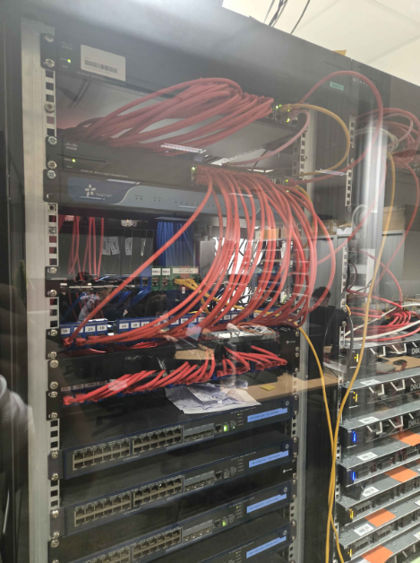
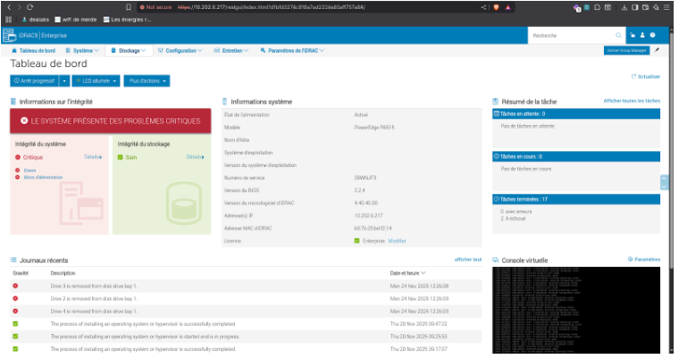
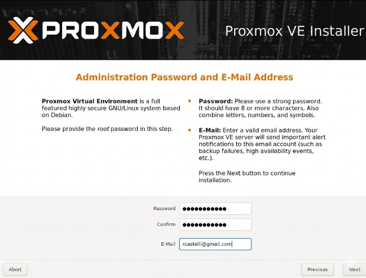
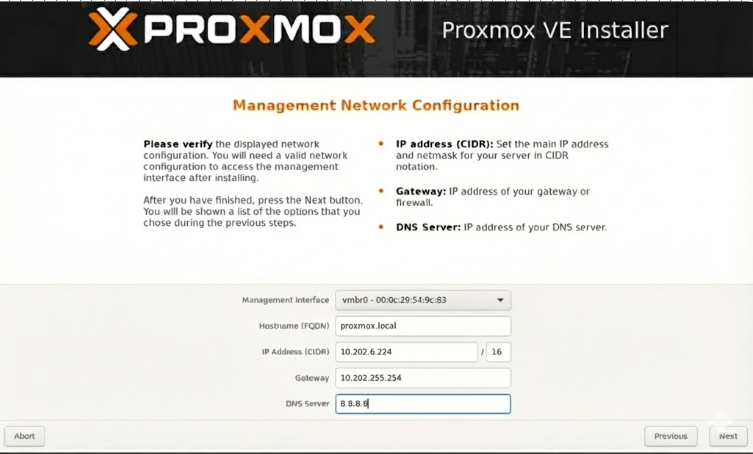
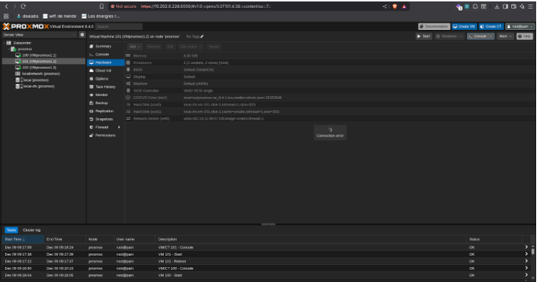
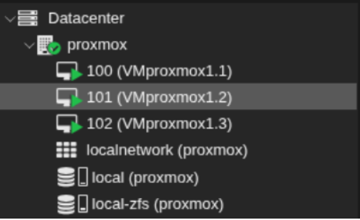
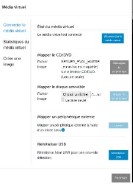
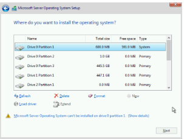
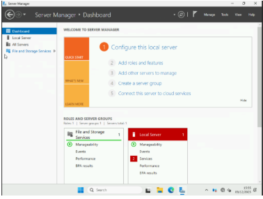
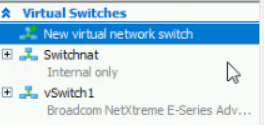

# Compte Rendu d'Installation des Solutions de Virtualisation

Ce document détaille l'avancement des travaux d'installation des hyperviseurs Proxmox VE et Hyper-V sur les serveurs dédiés.

---

## Jour 1 : Préparation et Installation de Proxmox

### 1. Réorganisation de la Baie (Commun)

Avant toute chose, nous avons, avec l’aide d’autres groupes, réorganisé les différentes baies, pour avoir un **câblage propre**, et pour permettre à ce que chaque groupe puisse savoir où il est branché.

Avec un câblage plus propre, chaque groupe a pu connecter les cartes iDRAC de ses serveurs pour travailler via les postes de la salle.

### 2. Configuration d’iDRAC (Commun)

Étant donné le nombre de groupes, il nous était impossible de tous travailler dans la salle serveur. Pour cela, nous avons configuré les cartes iDRAC de nos 2 serveurs.

#### Adressage des iDRAC

| Paramètre | iDRAC du switch 6 (Serveur Hyper-V) | iDRAC du switch 7 (Serveur Proxmox) |
| :--- | :--- | :--- |
| **Adresse IP** | `10.202.6.216` | `10.202.6.217` |
| **Masque** | `255.255.0.0` | `255.255.0.0` |
| **Passerelle** | `10.202.255.254` | `10.202.255.254` |
| **DNS** | `10.202.255.200` | `10.202.255.200` |

Quant aux solutions de virtualisation, nous avons décidé de choisir **Hyper-V** sur le serveur 6, et **Proxmox** sur le serveur 7.

#### Test de connexion

Nous nous sommes connectés, depuis un poste du réseau, à la page WEB iDRAC correspondant à notre serveur.

### 3. Installation de l'Hyperviseur Proxmox (Romain)

Pour commencer, nous avons décidé d’installer Proxmox sur notre serveur 7.

1. Téléchargement d'un ISO assez récent et placement sur le stockage le plus petit.
2. Redémarrage du serveur et boot sur l'installeur Proxmox.

#### Choix du Stockage
Lors de l'installation, nous avons sélectionné le système de fichiers **ZFS (RAID 0)**, comme convenu avec le professeur.

#### Sécurité et Réseau
* Nous avons choisi de **changer le mot de passe** pour quelque chose de plus approprié qui respecte certaines normes de sécurité, ainsi qu’une adresse mail à nous.
* Nous avons configuré la partie réseau de notre Proxmox en choisissant une adresse dans la même plage que notre iDRAC (`10.202.6.1-10.202.6.255`).

Après l’installation, notre Proxmox est **opérationnel**. Le projet peut continuer avec l'installation de 3 Proxmox en CEPH dans cet hyperviseur.

### 4. Création des Machines Virtuelles (Alexandre)

Nous avons créé les VMs nécessaires à la mise en place du cluster CEPH.

#### Tableau des VMs créées :

| ID VM | Nom | OS | CPU (Cores) | RAM (Go) | Disque (Go) | IP |
| :---: | :--- | :--- | :---: | :---: | :---: | :---: |
| 100 | PVE1 | Proxmox VE | 2 | 8.3 | 32 | 10.202.6.220/16 |
| 101 | PVE2 | Proxmox VE | 2 | 8.3 | 32 | 10.202.6.221/16 |
| 102 | PVE3 | Proxmox VE | 2 | 8.3 | 32 | 10.202.6.222/16 |

On voit que les 3 VMs sont **fonctionnelles** et en marche simultanément.

---

## Objectifs Seconde Journée (Suite du Projet)

* Installation de la seconde solution (Hyper-V sur le serveur 6) (Romain)
* Configuration d'Hyper-V pour qu’il soit 100% fonctionnel (Romain)
* Configuration du CEPH sur notre serveur 7 (Proxmox) (Alexandre)

---

## Jour 2 : Installation et Configuration de Hyper-V

### 1. Installation de Windows Server et Hyper-V (Romain)

Pour ce jour, nous avons **installé** la seconde solution choisie : **Hyper-V**.

#### Défis Rencontrés (Problèmes de Stockage et d'ISO)

1. **Stockage :** Le serveur 6 avait des soucis de stockage, car il restait des OS et des configurations d’autres groupes, ce qui a nécessité un long travail de remise à blanc.
2. **Partitionnement :** Les disques étaient partitionnés de manière assez étrange, ce qui bloquait l’installation complète de Windows Server (erreur arrivant à la fin de plusieurs dizaines de minutes d’installation).
3. **Incompatibilité d'ISO :** L’ISO que nous avions n’était pas compatible, générant une nouvelle erreur.

### 2. Configuration Hyper-V et Réseau

Une fois l'installation de l'OS finalisée, nous avons fait la configuration de base de Windows Server **au niveau** réseau. Nous sommes ensuite passés à l'étape importante qu’est l’installation d'Hyper-V.

Après avoir **installé** Hyper-V, la première chose à faire était de se concentrer sur la configuration réseau, donc à la création des **vSwitch** :
* Un en interne (NAT)
* Un en externe (Bridge)

#### Problème d'Adressage IP
J’ai eu un souci **au niveau** adressage IP : Quand je passais sur le vSwitch externe, mes VMs avaient directement un adressage **APIPA**. En changeant l’IP, les routes, etc., rien ne marchait et je ne pouvais même pas ping la passerelle. Pour y remédier, je suis passé par un vSwitch interne pour toutes nos VMs.

Enfin, nous avons vérifié que le service de l'hyperviseur était bien **actif et prêt** à héberger des VMs.

Ce compte rendu a été écrit à la main et mis en markdown par Gemini
