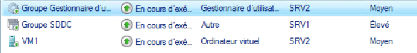
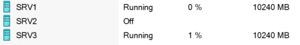
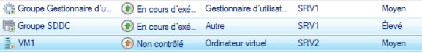
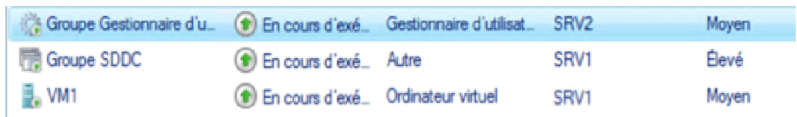
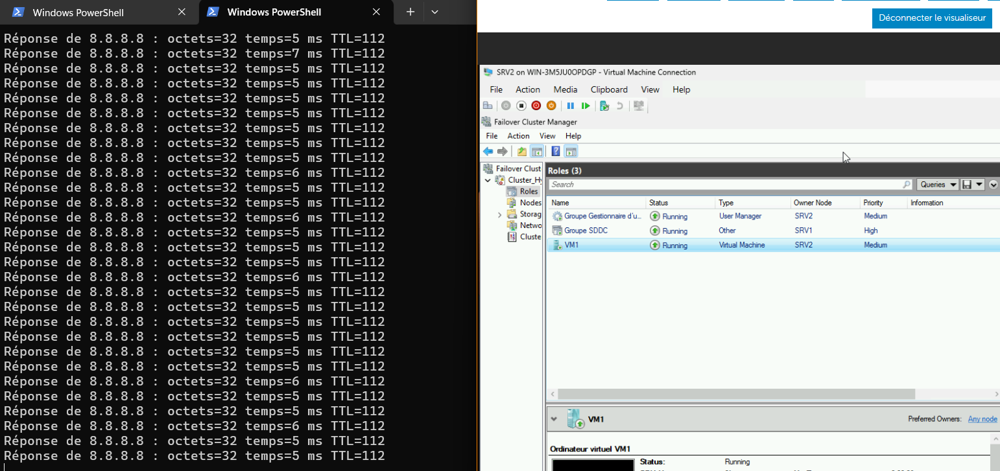

# RAPPORT TECHNIQUE : Déploiement d'une solution de cluster a basculement sous HyperV (Romain)


---

## 1. Introduction et Architecture Globale

Cette partie détaille la méthodologie de mise en œuvre d'une infrastructure de virtualisation à haute disponibilité (HA).

Pour simuler un environnement avec plusieurs nœud avec notre matériel, nous avons déployé une architecture en **Virtualisation Imbriquée (Nested Virtualization)** :

- **Niveau 0 (Physique) :** Serveur Dell exécutant Windows Server Datacenter.
    
- **Niveau 1 (Logique) :** Cluster de 3 machines virtuelles agissant comme nœuds.
    
- **Stockage :** Agrégation logicielle des disques via la technologie **Storage Spaces Direct (S2D)**.
    

---

## 2. Préparation de l'Infrastructure Physique (Niveau 0)

### 2.1 Matériel

L'infrastructure repose sur un serveur Dell  (Switch 6). La première étape a consisté à faciliter l'administration via la carte de gestion à distance (iDRAC).

- **Adressage iDRAC :** `10.202.6.216` /16
    
- **Passerelle :** `10.202.255.254`
    

L'accès iDRAC nous a permis de piloter l'alimentation, de monter les images ISO virtuellement et d'accéder à la console distante pour l'installation de l'OS.

### 2.2 Stockage Physique

Pour garantir le bon fonctionnement du futur S2D, il était important de présenter des disques vierges. Nous avons procédé à un nettoyage avant l'installation de l'OS, convertissant les disques au format GPT.

---

## 3. Configuration de l'Hyperviseur Hôte

### 3.1 Système d'Exploitation et Licences

Le choix s'est porté sur Windows Server édition Datacenter.

Contrairement à l'édition Standard, la version Datacenter est un prérequis pour l'activation de la fonctionnalité S2D et permet une virtualisation illimitée.

### 3.2 Activation du "MAC Address Spoofing"

C'est un point de configuration assez important pour le Nested Clustering. Par défaut, un port de vSwitch Hyper-V n'accepte que les trames provenant de l'adresse MAC de la VM connectée.

Or içi, les VMs imbriquées génèrent des trames avec leurs propres adresses MAC.

Nous avons activé l'usurpation d'adresse MAC sur les cartes réseaux virtuelles des 3 nœuds pour autoriser le transit de ces paquets :

PowerShell

```
Get-VMNetworkAdapter -VMName "Node*" | Set-VMNetworkAdapter -MacAddressSpoofing On
```

Sans cette commande, aucune communication réseau vers les VMs finales n'aurait été possible.

---

## 4. Implémentation du Cluster S2D (Cœur du système)


### 4.1 Storage Spaces Direct (S2D)

S2D permet de créer un stockage hautement disponible en utilisant des disques locaux attachés à chaque serveur, éliminant le besoin d'une baie SAN physique.

#### 4.1.1 Activation

Nous avons activé S2D (`Enable-ClusterS2D`) pour qu'il prenne le contrôle des disques, permettant à chaque nœud de lire et écrire sur les disques des voisins via le réseau.

#### 4.1.2 Stratégie de Résilience : Miroir à 3 Voies

Nous avons configuré le pool de stockage en **Miroir à 3 voies.

- **Fonctionnement :** Chaque bloc de donnée est écrit simultanément sur 3 disques situés sur 3 nœuds différents.
    
- Cette méthode offre la résilience maximale. Elle permet de tolérer la panne simultanée de **2 nœuds** (ou 2 disques) tout en garantissant l'intégrité des données.
- 
#### 4.1.3 Système de Fichiers ReFS

Les volumes partagés de cluster ont été formatés en ReFS (Resilient File System).

Avantages :

1. Détection et correction automatique de la corruption de données.
    
2. Optimisé pour la virtualisation et est donc plus performant.
    

#### 4.1.4 Gestion des vDisk

Lors de la création du volume vDisk_S2D (30 Go pour acceuillir la VM), nous avons laissé 50 Go d'espace non alloué dans ce même pool.

Cet espace de réserve permet au système de lancer une reconstruction automatique en cas de perte d'un disque.

---

## 6. Déploiement des Services et Validation


### 6.1 Tests de Résilience et Résultats

Une série de tests a validé le bon fonctionnement de la solution :

| **Test Effectué**      | **Méthodologie Technique**                                                               | **Résultat**                                                                                       |
| ---------------------- | ---------------------------------------------------------------------------------------- | -------------------------------------------------------------------------------------------------- |
| **Live Migration**     | Déplacement d'une VM active entre Nœud 1 et Nœud 2 via `Move-ClusterVirtualMachineRole`. | **Succès :** 0 perte de ping. Continuité de service assurée.                                       |
| **Failover (HA)**      | Simulation d'une panne matérielle du Nœud hébergeant le service Web.                     | **Succès :** Le cluster a détecté la perte de signal et a redémarré la VM sur un autre nœud        |
| **Intégrité Stockage** | Simulation de déconnexion d'un disque physique du pool S2D.                              | **Succès :** Le volume est resté "Online" en mode dégradé. Les VMs n'ont subi aucune interruption. |


---

# Compte Rendu journalier d'innstallation des solutions de virtualisation : Proxmox VE & Hyper-V

Cette partie vient rendre compte de comment les travaux ont avancés de manière journalière.

---

## Jour 1 : Préparation et Premiers Déploiements

### 1. Réorganisation de la Baie (Commun)

Avant toute chose, nous avons, avec l’aide d’autres groupes (notamment celui de Valentin, de Pierre et de Soyfoudine), réorganisé les baies de la salle pour avoir un **câblage propre** et identifier clairement les branchements de chaque groupe.


_Incident :_ Durant cette phase, une erreur de câblage a provoqué une boucle réseau, générant une tempête de broadcast d'environ **650 Go** sur le VLAN. L'incident a été identifié et corrigé grâce à l'intervention de Maxime.

Une fois le câblage fini, chaque groupe a pu connecter les cartes iDRAC de ses serveurs pour travailler à distance.

### 2. Configuration d’iDRAC et Adressage (Commun)

Nous avons configuré les cartes iDRAC de nos 2 serveurs (Switch 6 et 7).

Après analyse du plan d'adressage global (10.202.0.0/16), nous avons attribué une plage d'adresse à chaque groupe, et nous avons utilisé la plage 10.202.6.0/16 : 10.202.6.253/16

|**Paramètre**|**Serveur Hyper-V (Romain)**|**Serveur Proxmox (Alexandre)**|
|---|---|---|
|**IP iDRAC**|`10.202.6.216`|`10.202.6.17`|
|**Masque**|`255.255.0.0`|`255.255.0.0`|
|**Passerelle**|`10.202.255.254`|`10.202.255.254`|

#### Test de connexion

Nous nous sommes connectés via l'interface WEB iDRAC : 


### 3. Installation de l'Hyperviseur Proxmox (Alexandre)

Ici, je me suis occupé du serveur 7.

J'ai établi un premier cahier des charges : un hyperviseur principal (Bare Metal) hébergeant une infrastructure virtualisée (Nested) pour simuler un cluster.

1. **Installation :** Boot sur l'ISO Proxmox.
    
2. **Stockage :** Sélection du système de fichiers **ZFS (RAID 1)** sur les deux disques de 1To disponibles.
    
3. **Réseau & Sécurité :** Configuration de l'IP de management et sécurisation du mot de passe root.


Une fois Proxmox opérationnel, j'ai déployé 3 VMs qui serviront de nœuds pour notre futur cluster Ceph.

**Tableau des VMs Proxmox (Nested) :**

|**ID VM**|**Nom**|**OS**|**CPU**|**RAM**|**Rôle**|
|---|---|---|---|---|---|
|100|PVE1|Proxmox VE|2|8 Go|Nœud 1|
|101|PVE2|Proxmox VE|2|8 Go|Nœud 2|
|102|PVE3|Proxmox VE|2|8 Go|Nœud 3|

On voit ci-dessous que les 3 VMs sont **fonctionnelles**.


---

## Jour 2 : Installation Hyper-V et Cluster Proxmox HA

### 1. Installation de Windows Server et Hyper-V (Romain)

De mon côté, j'ai installé la solution Microsoft sur le serveur 6.

#### Difficultés rencontrées

1. **Stockage :** Nécessité de nettoyer les anciennes partitions des groupes précédents.
    
2. **Partitionnement :** Les disques avaient un formatage assez bizarre bloquant l'installateur Windows.
    
3. **ISO :** Incompatibilité de la première ISO testée.


Une fois Windows Server installé, j'ai configuré les **vSwitchs** :

- Tentative en mode Externe (Bridge) : Problème d'adressage APIPA.
    
- Bascule vers un vSwitch Interne (NAT) pour stabiliser le réseau des VMs.


### 2. Mise en place de la Haute Disponibilité sur Proxmox (Alexandre)

Pendant ce temps, sur le serveur Proxmox, j'ai finalisé la configuration du cluster pour la **Haute Disponibilité (HA)**.

- **Technologie utilisée :** J'ai couplé **Ceph (RBD)** pour le stockage distribué et **Corosync** pour la gestion du cluster.
    
- **Objectif :** Si le nœud virtuel `pve1` tombe, les services doivent redémarrer automatiquement sur `pve2` ou `pve3`.
    
- **Réalisation :** Le cluster a été initialisé et les premières VMs de test (Alpine Linux) ont été déployées sur le pool de stockage partagé `pool-vms`.
    

---

## Jour 3 : Réseau Hyper-V et Échec PBS

### 1. Résolution des problèmes réseaux Hyper-V (Romain)

J'ai passé une heure à debuguer une erreur **"Destination Host Unreachable"** sur ses VMs.

- **Cause :** Conflit d'IP entre le vSwitch et la carte physique, et confusion dans le nommage des interfaces.
    
- **Solution :** Réinitialisation de la couche réseau et renommage propre des adaptateurs. Tout est rentré dans l'ordre.
    

Par la suite, il a mis en place un **Storage Space (Espace de stockage)** en mode miroir sur Windows avec 2 SSD du serveur pour créer un disque **(J:)** sécurisé contre la panne d'un SSD physique.

### 2. Commencement des livrables (Romain)

Après avoir régler mes problèmes, j'ai décidé de prendre une pause sur les serveurs et consecrer du temps sur la réalisation des livrables :

- **Compte rendu journalier** : J'ai commencé à rendre compte les jours précedents pour ne pas prendre de retard sur ce dossier
    
- **Bilan financier :** J'ai commencé à me renseigner sur les prix de chaque choses prise en compte dans notre projet, autant matérielle que humaine.
 

### 3. Tentative d'intégration Proxmox Backup Server (Alexandre)

J'ai tenté d'intégrer **Proxmox Backup Server (PBS)** pour gérer les sauvegardes.

- **Problème critique :** L'importation de l'ISO dans le stockage local des nœuds virtuels (Nested) provoquait un redémarrage brutal (Kernel Panic) de l'hyperviseur parent.
    
- **Action :** Malgré une après-midi de tests avec M. Toulliou, le bug a persisté. J'ai pris la décision de préparer une réinstallation complète pour le lendemain afin de repartir sur des bases saines.
    

---

## Jour 4 : Diagnostic et Changement d'Architecture

### 1. Refonte de l'Architecture Proxmox (Alexandre)

Après de nouveaux tests infructueux avec M. Pouchoulon dans la matinée, j'ai validé la stratégie de refonte totale de la partie Proxmox pour adopter une approche **Hybride** :

- **Ceph (RBD) :** Maintenu pour les VMs critiques (Web, DNS) afin de garder la HA.
    
- **ZFS Local :** Introduit pour la VM "Client" pour gagner en performance disque.
    
- **ZFS Réplication :** Prévu pour le serveur de sauvegarde (PBS) afin d'assurer un Plan de Reprise d'Activité (PRA) sans dépendre du cluster Ceph.
    

### 2. Préparation du Cluster S2D Hyper-V (Romain)

J'ai profité de cette demi journée pour préparer le terrain pour la solution que j'ai choisi de mettre en place sur HyperV : **Le cluster S2D (Storage Spaces Direct)** 

J'ai validé certains prérequis réseaux, pu documenter les IPs et configuration des vSwitchs pour la bascule.
Grâce à cela, j'ai pu aussi prendre des notes afin de me faire un croquis du schéma réseau.


---

## Jour 4.5 (Romain/Week-end : ~6h30) : Cluster S2D à distance

### Travail à distance (VPN Tailscale)

Pour travailler à distance, pendant mon week-end, j'ai discuté avec le groupe de Valentin, Clovis et Dorian et j'ai fini par télécharger et installer le logiciel Tailscale sur mon serveur Windows, je me suis authentifié via la page web qui s'est ouverte, et j'ai refait exactement la même manipulation sur mon PC chez moi pour les relier au même compte. Une fois les deux machines actives, j'ai simplement récupéré l'adresse IP commençant par 100 fournie par l'application pour le serveur, j'ai ouvert l'outil "Connexion Bureau à distance" de Windows et j'ai collé cette IP. L'écran de connexion est apparu instantanément, j'ai entré mes identifiants habituels et j'ai pris le contrôle total du bureau de mon serveur à distance.

### Implémentation du Cluster S2D

- **Mise à niveau :** Passage de Windows Server Standard à **Datacenter** (via clé KMS) pour débloquer la fonction S2D.
    
- **Stockage :** Création d'un pool de stockage partagé utilisant les disques locaux des 3 nœuds (Miroir à 3 voies).

| Paramètre              | Valeur           | Justification                                                                    |
| :--------------------- | :--------------- | :------------------------------------------------------------------------------- |
| **Type de Résilience** | Miroir à 3 voies | Seule config qui tolère la perte de 2 nœuds simultanément.                       |
| **Formatage**          | ReFS             | Optimisé pour la virtualisation et l'intégrité des données.                      |
| **Capacité Utile**     | 30 Go            | Pour l'hébergement des VMs.                                                      |
| **Slack Space**        | 50 Go            | Espace non alloué laissé volontairement pour l'autoréparation (sur chaque nœud). |

    
- **Test de résilience :** 

Pour faire ce test, nous regardons d'abord sur quel noeud se trouve notre VM :



Etant sur le noeud 2, nous le shut down pour voir comment va réagir notre installation : 



On voit donc que, après avoir shutdown le noeud, que le cluster détecte automatiquement et rapidement que le noeud est tombé :




Après avoir attendu, on voit que la VM a redemmaré sur le noeud 1 (SRV1) : 



On voit que le test est réussi et que notre cluster est fonctionnel !


- **Migration à chaud :** On active le "MAC Address Spoofing" pour permettre le déplacement des VMs sans coupure réseau, puis, pour réaliser ce test, rienn de plus simple. On prend notre VM, et on appuie sur move -> live migration -> best possible node. Avant cela, on lance notre VM avec un ping infini vers google. Puis, on lance la migration dynamique. On voit qu'un ping est à 12ms (au lieu de 6 ou 5 pour tout les autres) quand on clique sur la migration, mais ils reprennent de manière normale juste après, sans coupure : 




Et voila, notre migration dynamique est fonctionnelle ! 
    

---

## Jour 5 : Le "Speed Run" Proxmox et dernière retouche HyperV

### 1. Refonte totale de la partie Proxmox (Alexandre)

Ayant validé la nouvelle architecture théorique, j'ai procédé à la réinstallation complète de l'environnement Proxmox en un temps record (4h) :

1. Reset iDRAC et réinstallation de l'hôte physique.
    
2. Déploiement des 3 nœuds virtuels.
    
3. Configuration immédiate des pools Ceph et ZFS.

### 2. Peaufinage de HyperV

J'ai pris un peu de temps pour m'assurer du fait que la migration dynamique se faisait bien de tout les serveurs vers les autres pour m'assurer du fonctionnement de mon cluster à basculement

### 3. Continuité des livrables (Commun)

### Romain 

Pendant qu'Alexandre faisait sa partie Proxmox, j'ai pas mal avancé ce compte rendu ainsi que le comparatif financier, arrivant à quelques conclusions en termes de budget.

### Alexandre

Après avoir fini ma refonte de Proxmox, j'ai pris le temps qu'il me restait pour mettre à plat ce que j'ai fais pour pouvoir le mettre dans ce compte rendu.


---

## Jour 6 : Déploiement des Services et Dimensionnement

### Alexandre : 

J'ai finalisé l'infrastructure Proxmox en déployant les services finaux. J'ai choisi **Alpine Linux** pour sa légèreté, permettant d'économiser nos ressources limitées.

### 1. Les VMs Services (Ceph & ZFS Local)

Configuration : **2 vCores, 2 Go RAM, 10 Go Disque**.

- **VM 105 (DNS) :** Serveur Bind9 (`10.202.6.53`) sur Ceph.
    
- **VM 106 (Web) :** Serveur Nginx (`10.202.6.54`) sur Ceph.
    
- **VM 107 (Client) :** Machine de test utilisateur sur **ZFS Local** (Performance).
    

[PHOTO A PRENDRE ICI : Vue "Summary" de Proxmox montrant la liste de tes VMs à gauche]

Figure : Vue d'ensemble des VMs déployées sur le cluster Proxmox.

### 2. Le Serveur de Sauvegarde (PBS)

Installation de **Proxmox Backup Server** (VM 110) sur un stockage **ZFS Répliqué** (pour la sécurité).

- **Ressources :** 4 Go RAM (pour la déduplication), 20 Go Disque.
    
- **Liaison :** Le Datacenter PVE a été connecté au PBS pour permettre les backups.
    

[PHOTO A PRENDRE ICI : Interface Dashboard du PBS (Bleue/Verte)]

Figure : Tableau de bord du serveur de sauvegarde PBS.

### Romain

Ayant fini ma partie technique, j'ai pu me consacrer a 100% aux livrables, j'ai mis au propre et en markdown ce compte rendu (Langage assez simple, mais que j'ai du apprendre).

J'ai ensuite mis au propre mes idées par rapport aux bilans financiers sur Excel pour avoir une vision claire de chaque dépense, et du seuil a partir duquel une solution devient plus rentable que l'autre (en regardant UNIQUEMENT le prix).

---

## Jour 7 : Supervision et Tests Finaux

### 1. Supervision Centralisée "Datacenter Manager" (Alexandre)

Pour assurer la veille technologique et la gestion globale, j'ai installé une solution de gestion centralisée (Datacenter Manager / Supervision) sur une VM dédiée (**ZFS, 8 Go RAM, 50 Go Disque**). Cela nous permet de visualiser la charge du cluster en temps réel.

[PHOTO A PRENDRE ICI : Interface de ton Datacenter Manager / Grafana]

Figure : Interface de supervision du Datacenter.

### 2. Validation Fonctionnelle (Alexandre)

Nous avons clôturé la semaine par les tests de validation :

- Test Service : Le client accède bien au site web www.sae.lan via le DNS interne.
    
    [PHOTO A PRENDRE ICI : Terminal Client avec un curl ou nslookup réussi]
    
- Test Backup : Sauvegarde manuelle de la VM DNS vers le PBS réussie.
    
    [PHOTO A PRENDRE ICI : Log Proxmox affichant "TASK OK"]
    

### 3. Bilan Financier et Documentation (Commun)

En cette fin de projet, nous avons mis en commun nos rapports, nos expériences, nos problèmes rencontrés pour essayer de comprendre ce que l'autre a fait. Bien que nous faisions des choses assez proches, le fait que l'un soit sur Proxmox et l'autre sur HyperV fait diverger les notions apprise et nous en avons conscience.

Nous avons écrit ce rapport journalier, le rapport technique ainsi que la synthèse pour que le livrable soit de la meilleure qualité possible.

